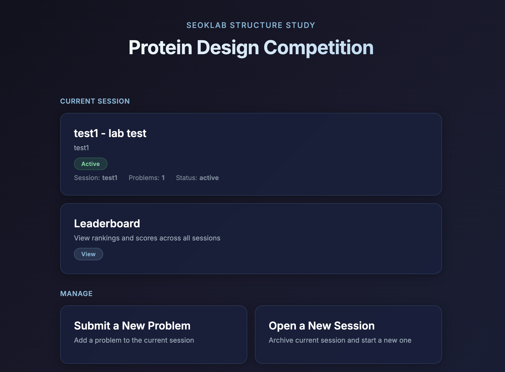
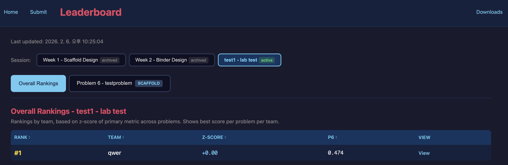

# SeokLab 구조스터디 - Protein Design Practice Platform

A platform for running protein design jobs using AlphaFold3 structure prediction, hosted on GitHub Pages.

Everything is done through the website — forms for creating sessions, adding problems, and submitting sequences. Behind the scenes, each form creates a GitHub Issue that triggers an automated workflow.



The home page shows the current session, links to submit sequences and view the leaderboard, and admin controls to add problems or open new sessions.


Use **"Submit a New Problem"** and **"Open a New Session"** from the home page to manage the competition. These open web forms that create GitHub Issues behind the scenes.



The leaderboard shows per-session rankings with z-scores across all problems. Switch between sessions using the tabs at the top.

| Page | URL | Purpose |
|------|-----|---------|
| **Home** | https://seoklab.github.io/structure-study | Main page with links |
| **Submit Sequences** | https://seoklab.github.io/structure-study/submit.html | Participants submit designed sequences |
| **Add Problem** | https://seoklab.github.io/structure-study/new-problem.html | Admins add a new target structure |
| **Leaderboard** | https://seoklab.github.io/structure-study/leaderboard.html | Rankings per session |
| **3D Viewer** | https://seoklab.github.io/structure-study/viewer.html | View predicted structures |

---

## Quick Start (Admin Workflow)

The typical flow for running a competition round:

1. **Create a session** — groups problems into a round (e.g. "Week 3")
2. **Add problems** — define target structures for participants to design sequences for
3. Participants **submit sequences** — via the web form
4. AlphaFold3 runs automatically, results appear on the leaderboard

Each action can be done through the website or directly via GitHub Issues. Both methods trigger the same automated workflows.

---

## Step 1: Create a New Session

A session is a competition round (e.g. `week3`). Creating a new session automatically archives the previous active session.

### Via GitHub Issue

1. Go to [Issues → New issue](https://github.com/seoklab/structure-study/issues/new/choose)
2. Select **"New Session"**
3. Fill in:
   - **Session Key** — short identifier like `week3`, `round2` (no spaces)
   - **Session Name** — display name like "Week 3 - De Novo Design"
   - **Description** — shown to participants
4. Submit the issue

The `new-session` workflow will:
- Add the session to `config.json` with `status: active`
- Set it as the `active_session`
- Archive the previous active session
- Comment on the issue with confirmation

### Via manual edit

Edit `docs/targets/config.json` directly:
```json
"sessions": {
  "week3": {
    "name": "Week 3 - De Novo Design",
    "status": "active",
    "description": "De novo protein design challenges",
    "problems": []
  }
}
```
Set `"active_session": "week3"` and change the old session's status to `"archived"`.

---

## Step 2: Add Problems to the Session

A problem defines a target structure that participants will design sequences for.

### IMPORTANT: Preparing PDB files before adding a problem

Target PDB files are publicly visible on GitHub Pages. To prevent participants from looking up the original structure, you **must** sanitize every PDB before submitting it:

1. **Mask all residues to ALA** — change every residue name to `ALA` in ATOM records
2. **Keep only backbone atoms** — retain only `N`, `CA`, `C`, `O`; remove all side-chain atoms and hydrogens
3. **Strip all identifying headers** — remove `HEADER`, `TITLE`, `COMPND`, `SOURCE`, `KEYWDS`, `EXPDTA`, `AUTHOR`, `REVDAT`, `JRNL`, `REMARK`, `DBREF`, `SEQRES`, `HELIX`, `SHEET`, and `MASTER` records. Only keep `CRYST1`, `ORIGX`, `SCALE`, `ATOM`, `TER`, and `END`.
4. **Use a generic filename** — never use the PDB ID (e.g. `1cq0.pdb`). Name it something like `problem_7.pdb` or `2helix-loop.pdb`.

Without these steps, participants can trivially identify the target by searching the PDB ID, reading SEQRES records, or inspecting the header in the 3D viewer.

### Via the website (recommended)

1. Go to https://seoklab.github.io/structure-study/new-problem.html
2. Fill in the required fields: problem name, type, session, description, metric, MSA mode
3. Provide the PDB structure using **one** of two methods:
   - **Server Path** — absolute path to a `.pdb` file already on the server
   - **Paste Content** — enter a filename and paste the raw PDB text
4. For **binder** problems, also fill in: target sequence, expected binder length, and optionally a target MSA path
5. Click **Submit via GitHub Issue** — this opens a pre-filled GitHub Issue

You can also go directly to [Issues → New issue → New Competition Problem](https://github.com/seoklab/structure-study/issues/new/choose), which additionally supports **file upload** (drag-and-drop `.pdb`).

The workflow will automatically:
- Write the PDB file to `docs/targets/`
- Assign a problem ID (`problem_6`, `problem_7`, ...)
- Update `config.json` and add the problem to the session
- Comment on the issue with the new problem ID

### Via manual edit

1. Place the PDB file in `docs/targets/`
2. Add an entry to the `"problems"` array in `docs/targets/config.json`
3. Add the problem ID to the session's `"problems"` list
4. Commit and push

---

## Step 3: Submit Sequences (Participants)

Participants design amino acid sequences and submit them for AlphaFold3 structure prediction.

### Via the website

1. Go to https://seoklab.github.io/structure-study/submit.html
2. Enter a **Participant ID** (e.g. `team1_week3`)
3. Select the **Session** — problems for that session appear automatically
4. For each problem, enter 1-5 amino acid sequences (one per line)
5. Click **Submit** — this creates a GitHub Issue which triggers the pipeline

### What happens after submission

1. A GitHub Issue is created with the `submission` label
2. The workflow parses the sequences and queues AlphaFold3 SLURM jobs on the server
3. A confirmation comment is posted on the issue with the submission ID
4. The `check_completion` workflow runs every 5 minutes to monitor SLURM jobs
5. When predictions finish, structures are evaluated (TMalign, lDDT) and the leaderboard updates
6. A final comment is posted on the issue with a link to view results in the [3D viewer](https://seoklab.github.io/structure-study/viewer.html)

---

## Tracking Progress via Issues

Every action creates a GitHub Issue with a specific label. You can filter issues to see what's happening:

| Filter | URL | What it shows |
|--------|-----|---------------|
| All submissions | [label:submission](https://github.com/seoklab/structure-study/issues?q=label%3Asubmission) | Every sequence submission |
| Completed | [label:submission label:completed](https://github.com/seoklab/structure-study/issues?q=label%3Asubmission+label%3Acompleted) | Submissions with results ready |
| Errors | [label:error](https://github.com/seoklab/structure-study/issues?q=label%3Aerror) | Any failed workflow (submission, problem, or session) |
| New problems | [label:new-problem](https://github.com/seoklab/structure-study/issues?q=label%3Anew-problem) | All problem additions |
| New sessions | [label:new-session](https://github.com/seoklab/structure-study/issues?q=label%3Anew-session) | All session creations |

Each issue contains the full history as comments:
- **Submission issues** get a confirmation comment when queued, then a results comment with viewer links when done
- **Problem issues** get a comment with the assigned problem ID, session, and residue count
- **Session issues** get a comment confirming which session was archived

Issues with the `error` label had a workflow failure — click through to the linked workflow run for details.

---

## Metrics Reference

Available values for `primary_metric` (used for ranking):

| Metric | Problem Type | Description |
|--------|-------------|-------------|
| `bb_lddt` | monomer | Backbone lDDT |
| `bb_lddt_cov` | monomer | lDDT x Coverage (penalizes partial matches) |
| `tm_score` | both | Template modeling score |
| `binder_lddt` | binder | Binder chain lDDT |
| `interface_lddt` | binder | Interface lDDT |
| `iptm` | binder | AlphaFold3 interface pTM |

---

## File Structure

```
├── .github/
│   ├── ISSUE_TEMPLATE/              # Issue forms
│   │   ├── new-session.yml          # New session form
│   │   └── new-problem.yml          # New problem form
│   └── workflows/
│       ├── new_session.yml          # Creates session from issue
│       ├── add_problem.yml          # Adds problem from issue
│       ├── process_submission.yml   # Parses submissions, queues AF3
│       ├── check_completion.yml     # Monitors SLURM, evaluates, updates leaderboard
│       └── end_competition.yml      # Final evaluation and archival
├── docs/                            # GitHub Pages site
│   ├── index.html                   # Main page
│   ├── submit.html                  # Sequence submission form
│   ├── new-problem.html             # Problem submission form
│   ├── leaderboard.html             # Leaderboard
│   ├── viewer.html                  # Mol* 3D structure viewer
│   ├── targets/
│   │   ├── config.json              # All sessions + problems
│   │   └── *.pdb                    # Reference structures
│   └── results/                     # Per-submission results
└── scripts/
    ├── parse_new_session.py         # Parse new session issues
    ├── parse_new_problem.py         # Parse new problem issues
    ├── parse_issue_submission.py    # Parse sequence submission issues
    ├── process_multi_submission.py  # Prepare AF3 SLURM jobs
    ├── evaluate_structure.py        # TMalign/lDDT evaluation
    └── update_leaderboard.py        # Aggregate rankings
```

## Credits

- [AlphaFold3](https://github.com/google-deepmind/alphafold3) — Structure prediction
- [TMalign/USalign](https://zhanggroup.org/TM-align/) — Structure alignment
- [PDBe-Molstar](https://github.com/molstar/pdbe-molstar) — 3D visualization
- [SeokLab](https://seoklab.org)
